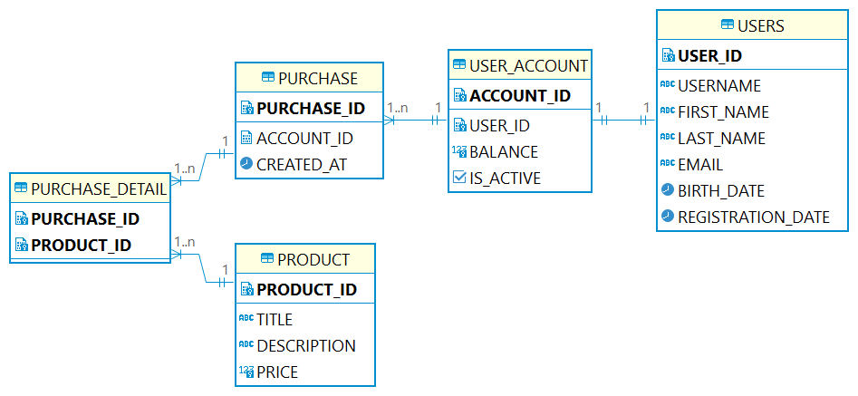

http://localhost:13000/swagger-ui/index.html



### Kafka
#### Start the ZooKeeper service
```shell
bin/zookeeper-server-start.sh config/zookeeper.properties
```
#### Start the Kafka broker service
```shell
bin/kafka-server-start.sh config/server.properties
```
#### Create topic
```shell
bin/kafka-topics.sh --create --topic pokupka24.purchases.v1 --bootstrap-server localhost:9092
```
#### Clean up
```shell
rm -rf /tmp/kafka-logs /tmp/zookeeper /tmp/kraft-combined-logs
```